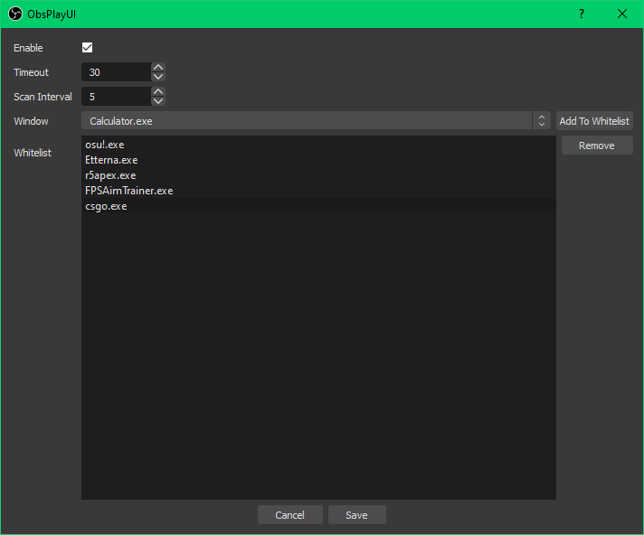

# obsplay
Emulate shadowplay recording behaviour with [OBS](https://github.com/obsproject/obs-studio) replay buffer.

Scans processes and turns on/off the replay buffer depending on whether any of the whitelisted programs are running.

Currently only supports Windows and Linux (Running X11 only)

# Compiling
1. Clone OBS
2. Clone this repo into ./UI/frontend-plugins
3. Append `add_subdirectory(obsplay)` to CMakeLists.txt
4. Compile OBS normally and extract the plugin from the build directory